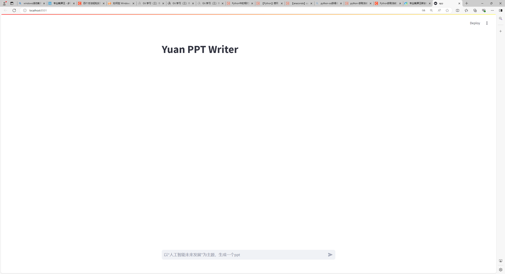

# YuanPPT 幻灯片生成工具



`YuanPPT` 幻灯片生成工具是`Yuan-2.0`的一部分。以`YuanChat`为主要后台推理服务，同时也兼容以`Ollama`作为推理服务。通过使用`YuanPPT`，可以让用户轻松地按照主题生成和修改幻灯片。

## 开始

* YuanPPT启动
* 配置推理服务

### YuanPPT启动

克隆项目到本地目录中

```
git clone ssh://git@10.128.4.12:6222/yuanchat/yuanppt.git
cd yuanppt
```

安装所需要的 python 依赖

```
pip install -r requirements.txt
```

运行 streamlit 项目

```
streamlit run app.py
```

### 推理服务部署

#### 方式1：YuanChat API Server

1. YuanChat安装

     YuanChat安装请参考文档：[YuanChat安装部署](https://github.com/IEIT-Yuan/YuanChat/blob/main/docs/YuanChat%E9%80%9A%E7%94%A8%E7%89%88%E6%9C%ACV0.5.md)

2. YuanChat开启API Server功能

     

支持配置 API Server 功能。配置服务端口，开启服务（服务记录上次使用端口，默认为 5051）。服务开启后，可查看 API server 支持的模型列表；支持模型输出数据转换为 openAI 格式。 可以通过配置参数开启/关闭 API Server 功能，并设置 API Server 服务的端口号。

修改`generate_ppt_stream.py`中的`IP address`和`port`

```
host = "localhost"
port = "5051"
```

#### 方式2： Ollama

安装 [ollama](https://ollama.ai/download)
使用 Command 启动并运行 `ollama serve`

下载所需模型

```
ollama pull llama3.1:8b
```

修改`generate_ppt_stream.py`中的`IP address`和`port`

```
host = "localhost"
port = "11434"
```


##### 已适配的模型

下表为 Ollama 提供的部分模型，已在是 YuanPPT 中完成适配，在 PPT 模板生成时表现良好

<table>
    <tr>
        <td>qwen</td> 
        <td>mistral</td> 
        <td>gemma</td> 
        <td>llama</td> 
   </tr>
   <tr>
        <td>qwen2.5:7b</td> 
        <td>mistral:7b</td> 
        <td>gemma2:9b</td> 
        <td>llama3.1:8b</td> 
   </tr>
</table>
该幻灯片生成器已经过全面调整和优化，以确保它集成并有效利用大模型`Yuan-2.0`系列及其他开源模型；之后我们将涉及更深层次的技术层面对接，包括数据接口、算法兼容性、性能调优等，增强用户体验的流畅性


## 使用

访问 URL: [http://localhost:8501](http://localhost:8501)


1.在文本框中输入一个主题;


2.PPT 生成后，按下载按钮下载 ppt;


3.如果要重建某些章节，请输入“修改第 XX 章”，按 Enter 键并重复 2 中的步骤.


4. PPT 生成样例：


