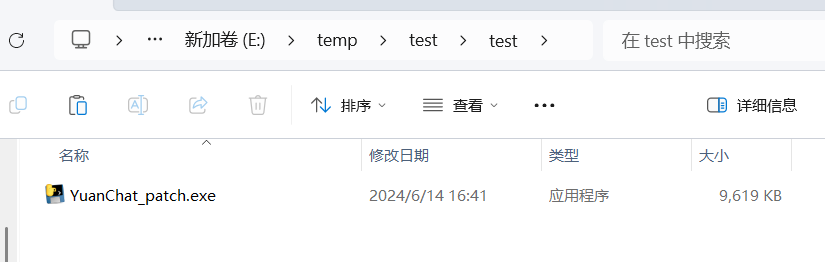
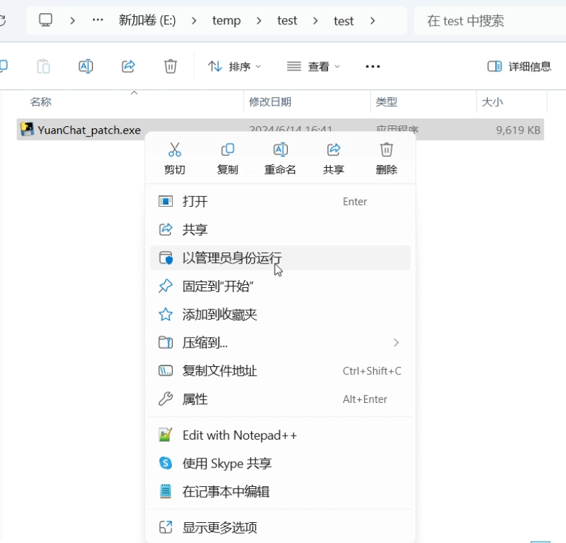
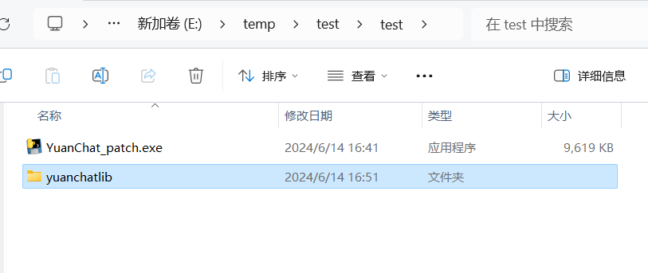
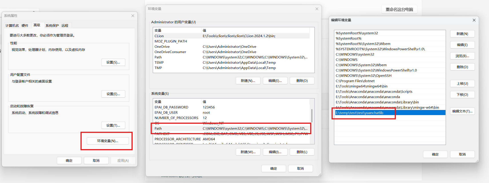

# YUANCHAT补丁程序使用说明

### 🌟 补丁下载地址

[百度云盘](https://pan.baidu.com/s/1gGMiY--YSZVX5lFl5IuQYQ?pwd=r2i7) |
[阿里云盘](https://www.alipan.com/s/Q2asLEkTa3i)

此补丁程序是在加载或使用YUAN GGUF相关模型时，如果产生报错，则按照如下的方法运行设置。

### 🌟 步骤 1

将**YuanChat_patch.exe**程序移动到任意文件夹位置，如下图所示：

### 🌟 步骤 2

然后**右键**选择“**以管理员身份运行**”：

### 🌟 步骤 3

程序执行完成后，会自动退出当前窗口，并且会在当前目录下生成**yuanchatlib**文件夹。

### 🌟 步骤 4

验证：打开系统环境变量（右键“此电脑”-“属性”-“高级系统设置”-“环境变量”，在系统环境变量框中双击“Path”），可以看到**yuanchatlib**所在路径已经添加到系统环境变量中。

### 🌟 步骤 5

删除原来的数据（位置一在`C:\Users\{your-user-name}\.yuanchat\yuanchat.db`），然后再重新启动**Yuanchat.exe**程序，尝试加载YUAN GGUF相关模型，并进行对话。

在此过程中有任何问题，请联系YuanChat相关人员进行反馈☎️，我们会在第一时间为您处理。再次感谢您的使用！🌹