# YuanChat全面升级：知识库、网络检索、全新交互体验、适配intel XPU

嗨，大家好，很高兴跟大家分享全新的`YuanChat`，欢迎大家下载体验。
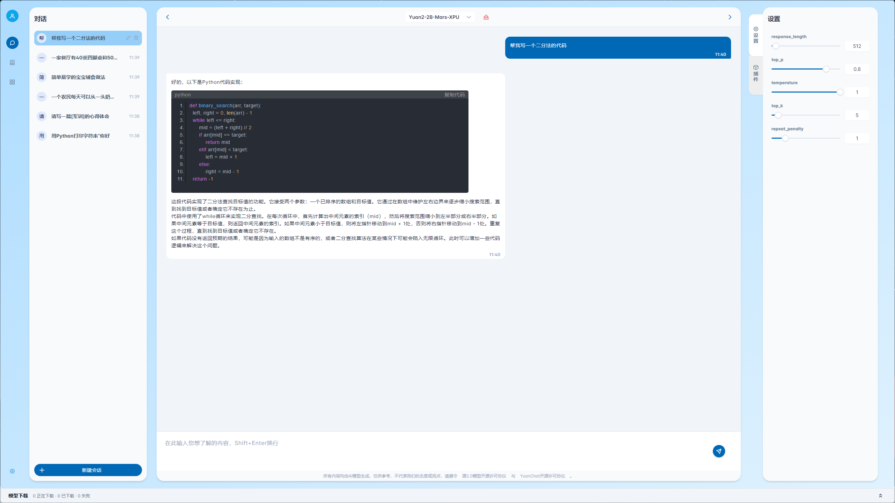

## 更新内容
* 新增知识库能力，支持`docx`, `pdf`, `txt`格式文件，多种检索算法支持
* 新增网络检索能力
* 多模型适配
* 重新设计软件界面，布局更合理，操作更方便
* 英特尔® 酷睿™ Ultra处理器平台（XPU）适配，推理速度24 token/s

> ***本次更新为YuanChat XPU版本，通用版本详见 [YuanChat全面升级通用版本](./YuanChat全面升级通用版本.md)***
## 1. 配置要求 
* 可使用内存：4GB 以上
* 系统: windows10/11 64位

## 2. 软件下载
### 2.1 百度云盘
**链接**：

## 3. 安装和运行

> `YuanChat.exe`占用本地的`5050`端口，如果系统中有其他应用占用了此端口会导致`YuanChat.exe`启动失败，请使用前确认系统环境。

### 3.1 安装
通过此[链接]()下载`YuanChat`的安装包，根据提示进行安装部署

**安装1**

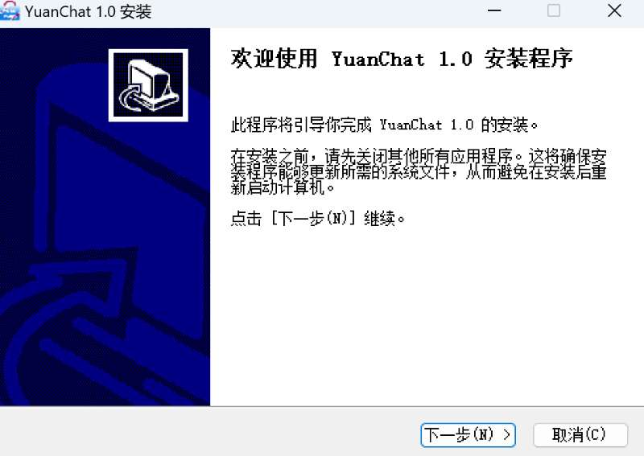

**安装2**

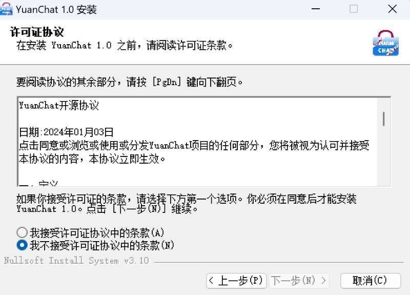

**安装3**

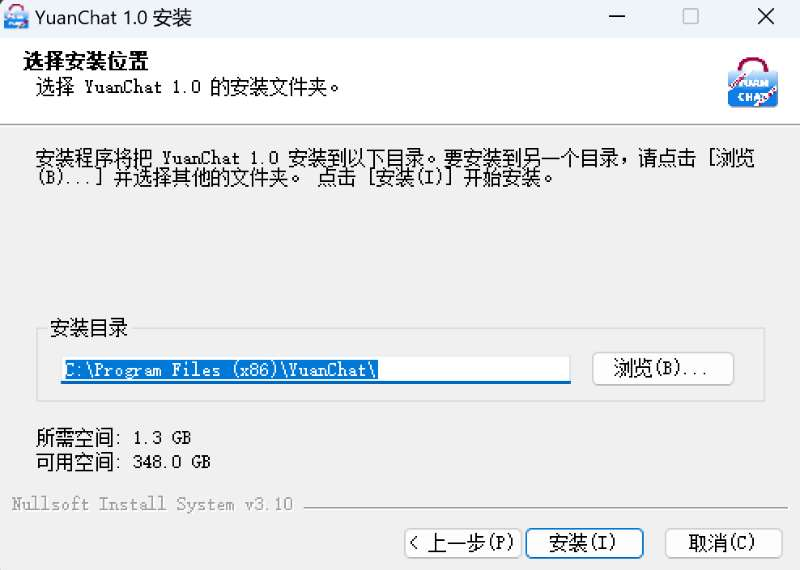

**安装4**

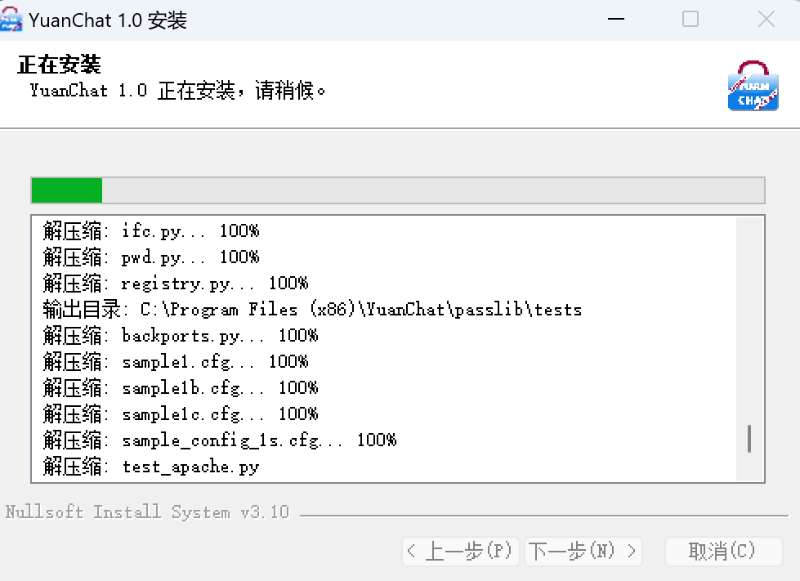

**安装5**

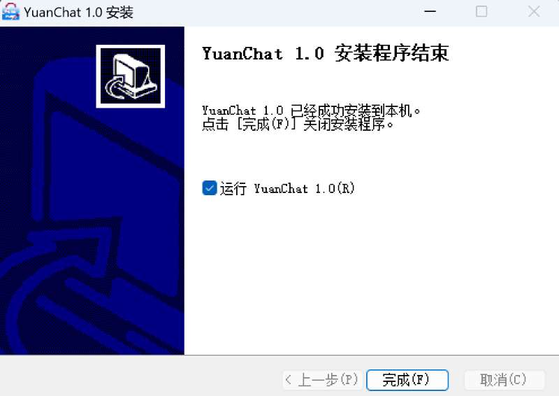

### 3.2 运行
***初次运行YuanChat，需要配置存储路径，此路径用于保存下载模型和知识库文件***

**配置存储路径**

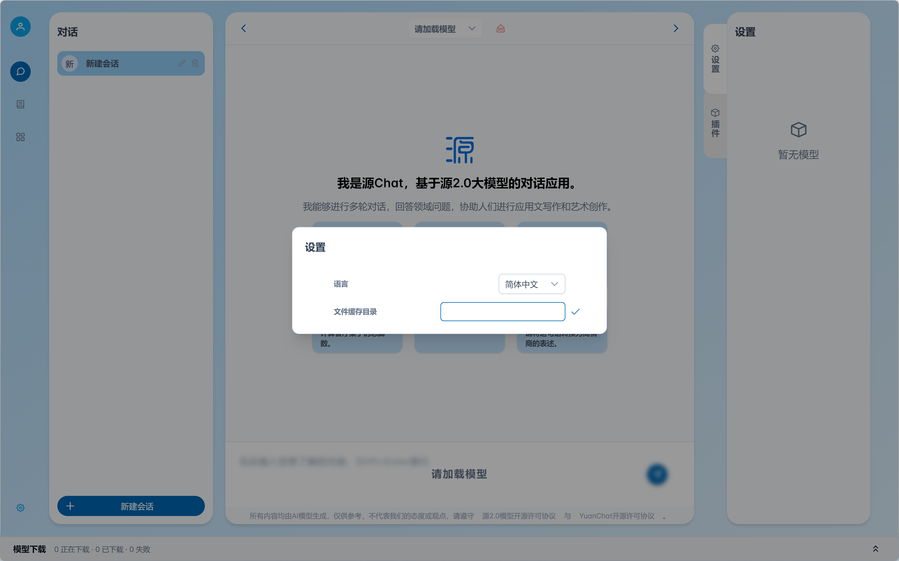

**下载模型**
> 初次使用YuanChat需要下载模型，通过左侧模型管理页面进行下载

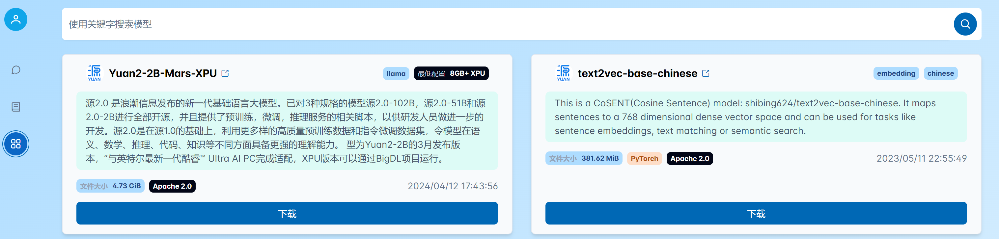

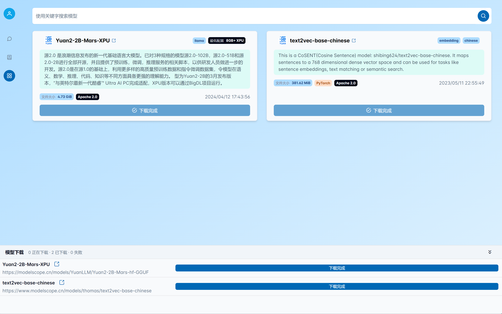

**加载模型**

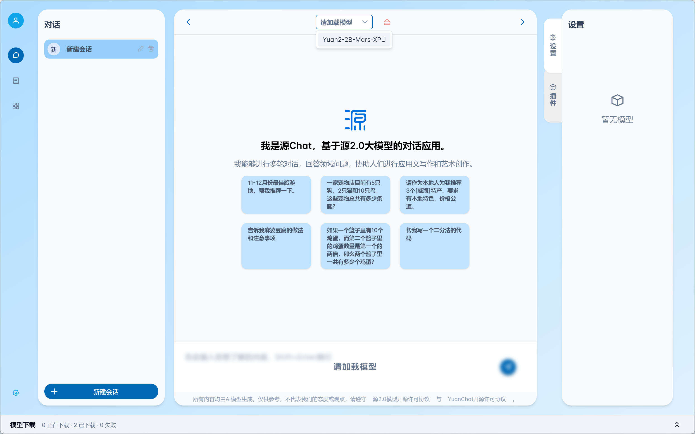

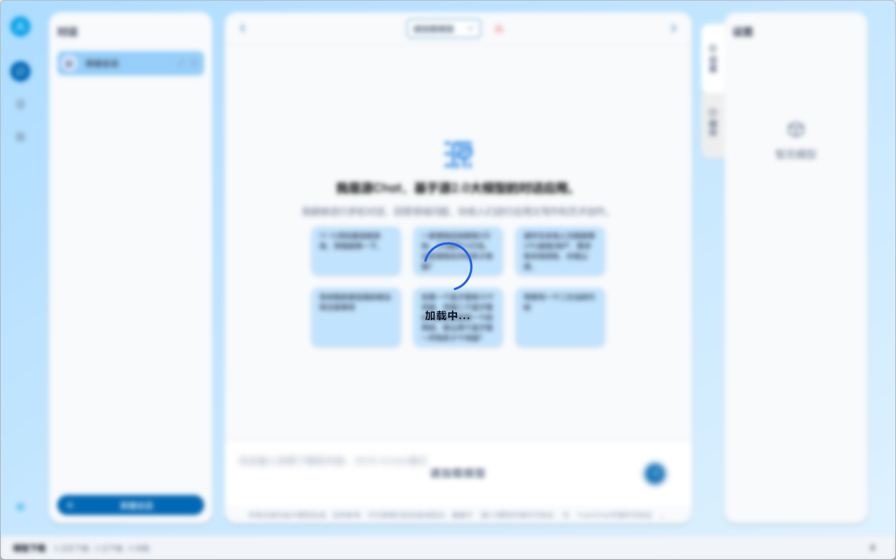

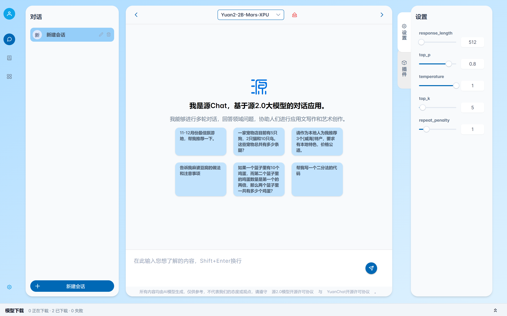

## 4. 问题反馈
如果在使用程序过程中有任何问题，欢迎在本项目的`issue`中进行提问