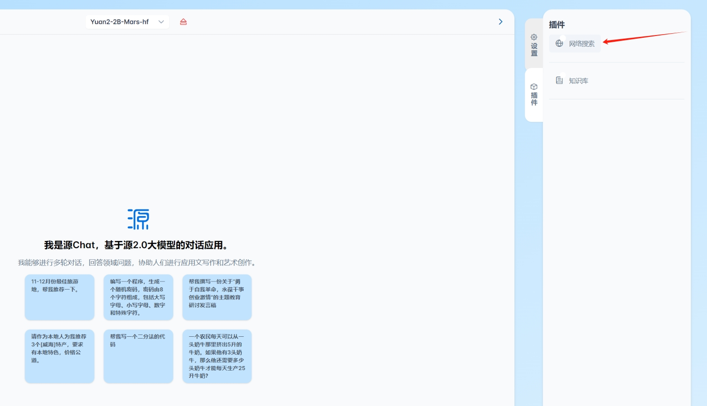

# YuanChat全面升级：知识库、网络检索、全新交互体验、适配CPU

嗨，大家好，很高兴跟大家分享全新的`YuanChat`，欢迎大家下载体验。

## 更新内容
* 新增知识库能力，支持`docx`, `pdf`, `txt`格式文件，多种检索算法支持
* 新增网络检索能力
* 多模型适配
* 重新设计软件界面，布局更合理，操作更方便

> ***本次更新为YuanChat CPU通用版本，支持XPU，详见 [YuanChat全面升级XPU版本](./YuanChat全面升级XPU版本.md)***
## 1. 配置要求 
* 可使用内存：4GB 以上
* 系统: windows10/11 64位

## 2. 软件下载
### 2.1 百度云盘
**链接**： https://pan.baidu.com/s/13-1L0K6N1agMw5gZbl5xeg?pwd=7ap1

## 3. 安装和运行

> `YuanChat.exe`占用本地的`5050`端口，如果系统中有其他应用占用了此端口会导致`YuanChat.exe`启动失败，请使用前确认系统环境。

### 3.1 安装
通过此[链接](https://pan.baidu.com/s/13-1L0K6N1agMw5gZbl5xeg?pwd=7ap1)下载`YuanChat`的安装包，根据提示进行安装部署

**安装1**

**安装2**

**安装3**

**安装4**

### 3.2 运行
***初次运行YuanChat，需要配置存储路径，此路径用于保存下载模型和知识库文件***

**配置存储路径**

**下载模型**
> 初次使用YuanChat需要下载模型，通过左侧模型管理页面进行下载

下载完成后，按钮变为【下载完成】，且置为灰色，不可点击。

**加载模型**

此时，回到会话页面，可以在模型选择处，进行模型的加载。

加载过程视模型大小和个人电脑性能而不同。

加载完成后，右侧【设置】栏将显示该模型的一些基本使用参数，如下图

至此，您可以尽情使用对话了。

**会话管理**

针对会话功能，我们可以新建会话开启一个新的会话，可以对会话名称进行修改，也可以将某个会话进行删除。
1. 新建会话

点击新建会话将开启一轮新的会话。

2. 编辑会话

点击此处按钮，将对会话名称进行修改。

点击【√】或者【×】对新名字进行保存或取消。

3. 删除会话

**知识库使用**

1. 知识库创建、修改、删除

2. 使用知识库进行对话

3. 使用单文件进行对话
如果您只有一个文件，且不想使用知识库，您可以只使用单个文件进行对话，具体如下：

**使用网络检索增强**

同之前[支持网络搜素增强](支持网络搜索增强.md)介绍的功能，当前版本支持使用网络检索增强，网络搜索使用的是搜索引擎服务Serper，因此首先需要准备搜索引擎服务Serper的API Key，通过 https://serpapi.com/ 注册获取。

使用时，需要先开启网络检索的开关，

打开后需要配置基本信息，

配置完成，就可以使用了。

## 4. 问题反馈
如果在使用程序过程中有任何问题，欢迎在本项目的`issue`中进行提问