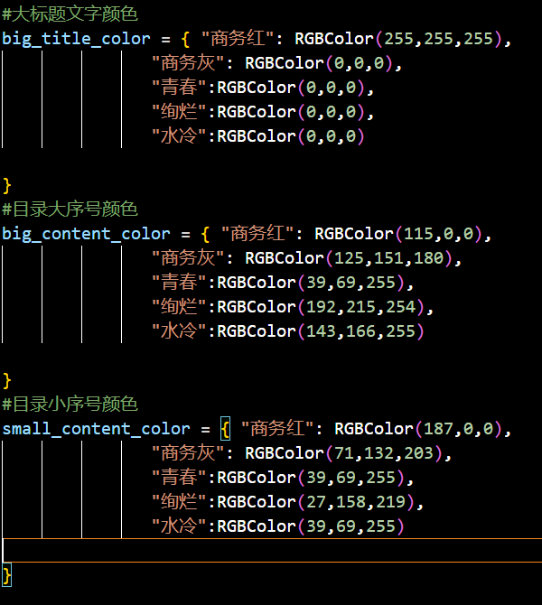
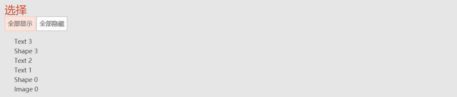
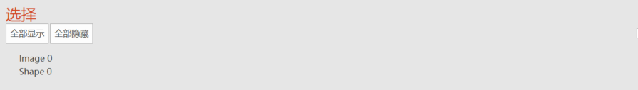
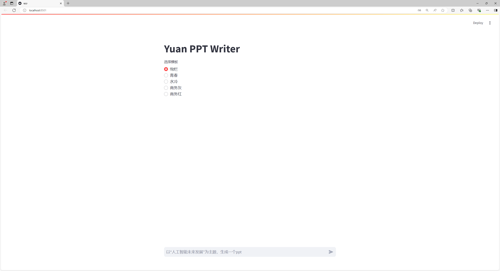
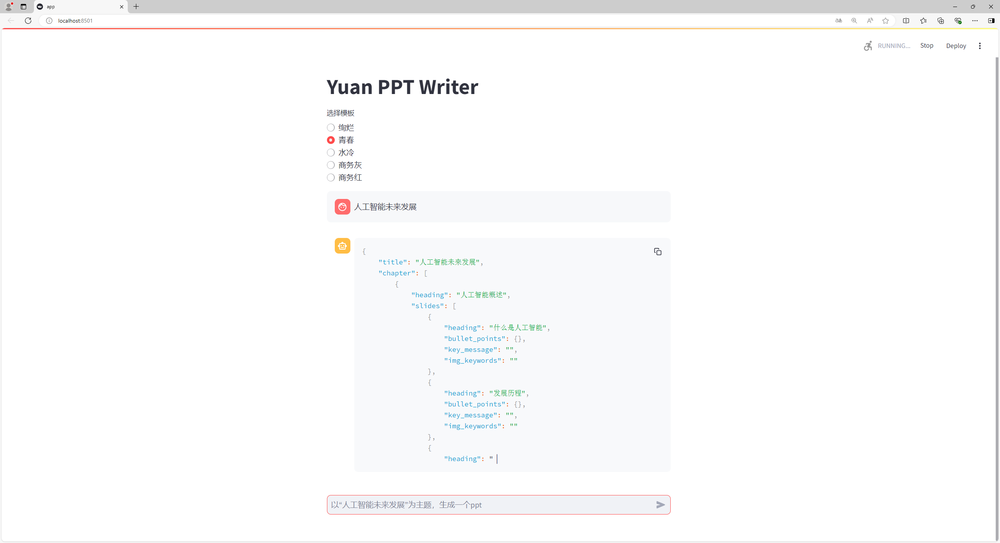
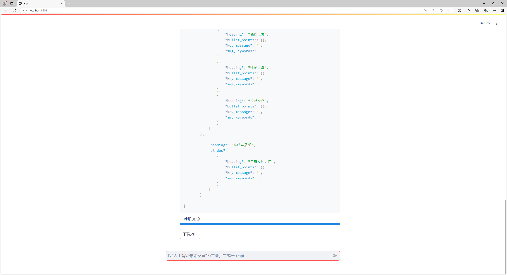
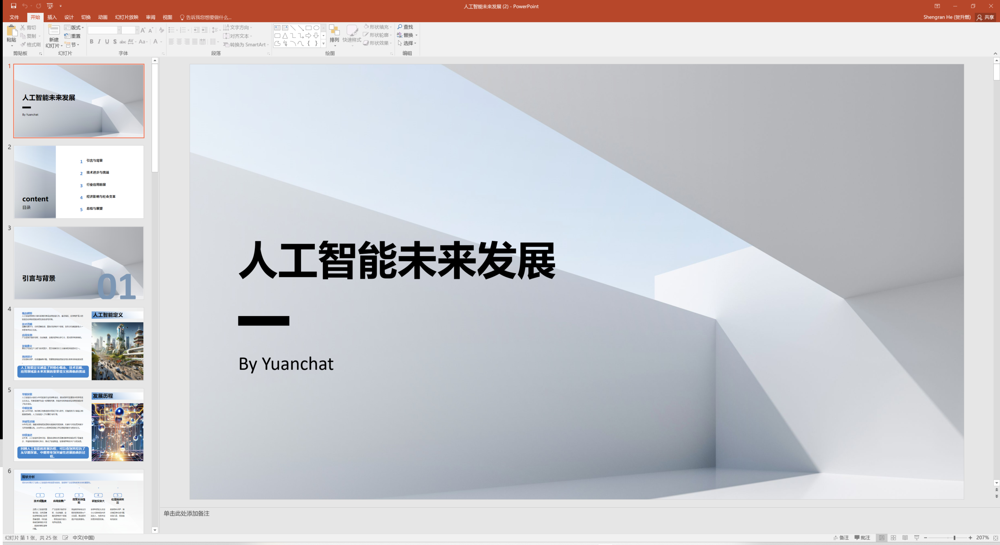
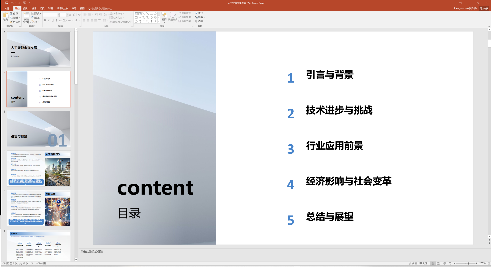
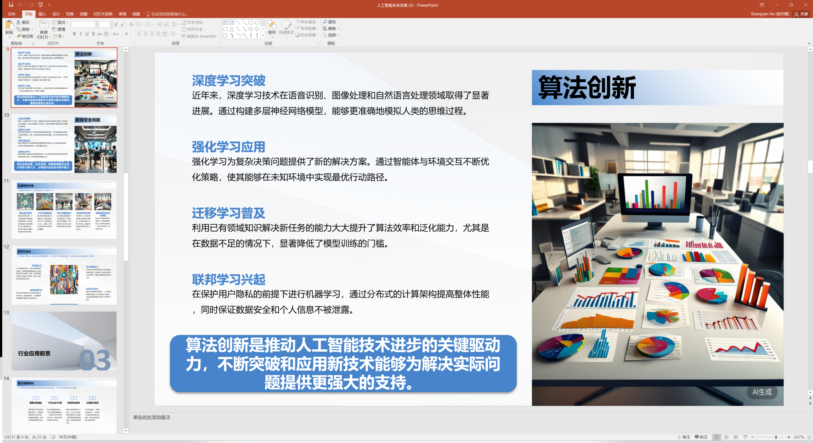
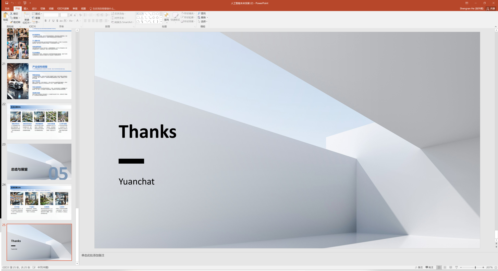

# YuanPPT 智能体生成框架

嗨，大家好，很高兴跟大家分享，`YuanPPT`迎来优化，升级版本V0.9，欢迎大家下载体验。

## 更新内容
* 增加PPT模板选择:提供多种不同风格的PPT模板，支持修改后的自定义PPT模板使用
* 图片检索升级：最新提供四种不同风格的PPT图片生成方式
* 幻灯片生成器优化：优化PPT内容生成速度与质量，增加内容排版样式

## 展示模板选择

### 默认模板使用
点击选择按钮，选择模板类型


### 自定义模板流程

`YuanPPT`提供5套默认模板，如需使用自己的模板，可根据默认模板格式进行设计，在模板文件夹中添加模板文件，修改模板选择文件，添加模板名称，即可使用。

#### 1.添加模板

将模板添加到模板文件夹`icons/template_background/`

#### 2.修改模板选择文件

修改模板选择文件`template_select.py`，添加自定义模板中对应文字的颜色



#### 3.修改模板内容

修改自定义模板，请遵循以下模板变量定义自己的模板
PPT模板共6页：标题页、目录页、章节标题页、模板背景页1、模板背景页2、结束页

##### 标题页



`Image 0` PPT背景占位符；`Text 2` 标题占位符；`Text 3` 作者名称占位符


##### 目录页
只保存三个占位符


`Image 0` PPT背景占位符；`Text 1` content；`Text 2` 目录

##### 章节标题页


`Image 0` 背景占位符；`Text 0`  标题占位符；`Text 2`  关键词占位符；`Text 3`  序号占位符

##### 背景页


`Image 0` PPT背景占位符
本框架预留了两个背景图，分别保存在模板中第四张第五张幻灯片中
###### 结束页


`Image 0` 背景占位符；`Text 1`  Thanks 占位符；`Text 3`  作者占位符

#### 4.添加模板名称

模板名称写入到`app.py`配置中

```python
template = st.radio("选择模板",("绚烂","青春","水冷","商务灰","商务红"))
```

#### 5.保存并重启
可选择自己添加的自定义模板


## 图片检索升级

图片检索功能已升级，支持四种方式生成图片：

* 使用Pixabay网站API检索图片；

* 使用HuggingFace的API生成图片；

* 使用Zhipu大模型的API生成图片；

* 使用Huggingface开源模型本地生成图片。

配置文件在config.py函数中，使用mode_select参数选择图片检索方式即可

经过测试四种方法情况如下：

1.Pixabay网站API检索图片：开源图片检索网站，需申请API KEY，支持中文提示词，检索速度较慢，易超时，图片库中检索的图片不匹配；

2.HuggingFace的API生成图片：不支持中文提示词，`yuanppt`将图片检索关键词汉译英后请求文生图的API，生成速度较快、图文匹配较高；

3.Zhipu大模型的API生成图片：支持中文提示词，智谱开发平台注册账号，申请api密钥，生成速度快、图文匹配高，是`yuanppt`推荐使用的文生图方法；

4.Huggingface上下载的本地模型生成图片：不支持中文提示词，需使用本机系统资源，在i71355U+16G内存的情况下可运行的模型包括：`runwayml/stable-diffusion-v1-5`、`etri-vilab/koala-lightning-700m`，生成速度慢、图文匹配较高。


# YuanPPT V0.8配置配置方式(适用V0.9更新版本)


# 开始

## 本地运行项目

克隆项目到本地目录中

```
git clone git@github.com:IEIT-Yuan/YuanChat.git
cd yuanchat/ppt
```

安装所需要的 python 依赖

```
pip install -r requirements.txt
```

运行 streamlit 项目

```
streamlit run app.py
```

## 本地部署 Ollama

安装 [ollama](https://ollama.ai/download)
使用 Command 启动并运行 `ollama serve`

下载所需模型

```
ollama pull llama3.1:8b
```

修改`generate_ppt_stream.py`中的`IP address`和`port`

```
host = "localhost"
port = "11434"
```

## 服务器部署 Ollama

在服务器上部署 ollama 服务以加速模型推理,在本地请求 ollama 远程服务

服务器部署 Ollama

```
curl -fsSL https://ollama.com/install.sh | sh
```

修改 Ollama 配置路径 `/etc/systemd/system/ollama.service`
配置文件内容如下，按照环境需要进行修改

```
[Unit]
Description=Ollama Service
After=network-online.target

[Service]
ExecStart=/usr/bin/ollama serve
User=ollama
Group=ollama
Restart=always
RestartSec=3
# 配置远程访问
Environment="OLLAMA_HOST=0.0.0.0:11434"
# 配置跨域请求
Environment="OLLAMA_ORIGINS=*"
# 配置OLLAMA的模型存放路径, 默认存放路径为/usr/share/ollama/.ollama/models/
Environment="OLLAMA_MODELS=/home/ollama/.ollama/models"
# 指定GPU
Environment="CUDA_VISIBLE_DEVICES=0,1,2"

[Install]
WantedBy=default.target
```

启动 Ollama 服务

```
sudo systemctl daemon-reload
sudo systemctl enable ollama
sudo systemctl start ollama
```

修改 ollama 配置文件，你需要重新加载配置并重启服务

```
sudo systemctl daemon-reload
sudo systemctl restart ollama
```

修改`generate_ppt_stream.py`中的`IP address`和`port`

```
host = "ip"
port = "11434"
```

## 模型

下表为 Ollama 提供的部分模型，已在是 YuanPPT 中完成适配，在 PPT 模板生成时表现良好

<table>
    <tr>
        <td>qwen</td> 
        <td>mistral</td> 
        <td>gemma</td> 
        <td>llama</td> 
   </tr>
   <tr>
        <td>qwen2.5:7b</td> 
        <td>mistral:7b</td> 
        <td>gemma2:9b</td> 
        <td>llama3.1:8b</td> 
   </tr>
</table>
该幻灯片生成器已经过全面调整和优化，以确保它集成并有效利用我们的大型模型`Yuan-2.0`；之后我们将涉及更深层次的技术层面对接，包括数据接口、算法兼容性、性能调优等，增强用户体验的流畅性

## API Server 功能

支持配置 API Server 功能。配置服务端口，开启服务（服务记录上次使用端口，默认为 5052）。服务开启后，可查看 API server 支持的模型列表；支持模型输出数据转换为 openAI 格式。 可以通过配置参数开启/关闭 API Server 功能，并设置 API Server 服务的端口号。

```
API_Server_Port = 5052
API_Server_Enable = True
```

## 使用

访问 URL: [http://localhost:8501](http://localhost:8501)



1.在文本框中输入一个主题;



2.PPT 生成后，按下载按钮下载 ppt;



## 生成的PPT内容展示

1.PPT主题页面



2.PPT章节目录页



3.PPT内容页



4.PPT结束页

