# YuanChat V0.5 通用版本升级：知识库、网络检索、插件市场、模型管理功能增强

嗨，大家好，很高兴跟大家分享，`YuanChat`升级版本V0.5，欢迎大家下载体验。

## 更新内容
### 新增功能
* 单文档对话
* 插件市场
* 黑白主题切换
* `API Server`兼容`openai`格式返回模型推理数据
### 增强功能
* 提升知识库能力，支持多种`embedding`模型，及多种文档类型
* 增强网络检索能力，支持`bing`检索
* 模型管理支持文件级下载、暂停、删除、迁移等
* 支持对话分组、重新生成、对话内容导出、模型精度切换

> ***本次更新为YuanChat CPU通用版本的升级，XPU暂未升级，敬请期待***

## 1. 配置要求 
* 可使用内存：4GB 以上
* 系统: windows10/11 64位

## 2. 安装运行

**下载链接**：

[百度云盘](https://pan.baidu.com/s/14tWYodf2fd9tOpOEwh7UUA?pwd=ifwp) |
[阿里云盘](https://www.alipan.com/s/dfJrFSnUhkT)

同之前安装步骤，请参照[**YuanChat全面升级：知识库、网络检索、全新交互体验、适配CPU** :point_right:](./docs/YuanChat全面升级通用版本.md)

## 3. 详细介绍

### 3.1 黑白主题切换

为了更好的适配系统亮度，增加了黑白主题切换功能，操作步骤如图：

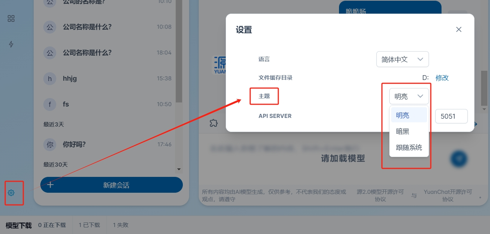

用户可以选择明亮、暗黑、跟随系统三个选项，点击即可切换。

### 3.2 提升知识库能力

本次升级，知识库新支持了多种文档类型，在新建知识库时，第二步上传文件时中，可以看到全部的支持的类型，具体文档类型包含：

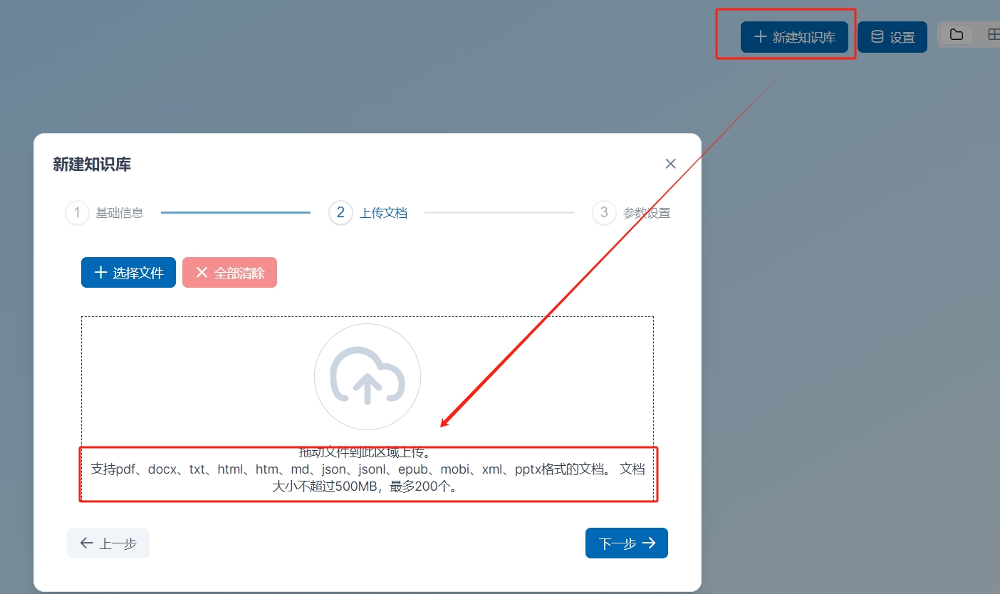

另外，知识库支持多种`embedding`模型，下拉框图中会有当前已有的模型，具体参考：

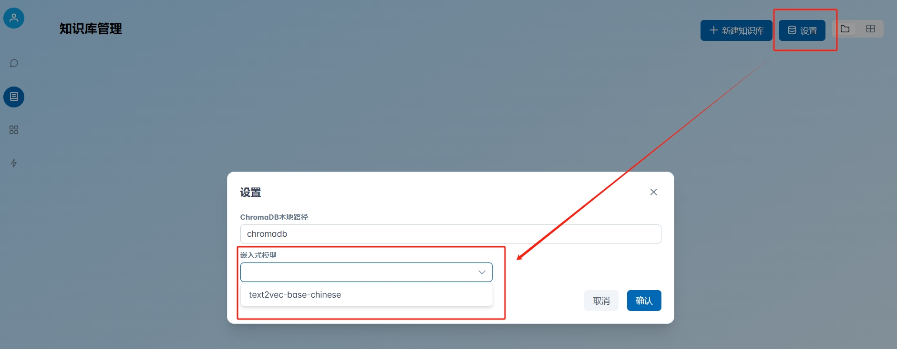

### 3.3 增强网络检索能力
本次支持，增强了网络检索能力，支持了`bing`检索，可以选择`serper`和`bing`两种方式进行检索增强，具体如下：

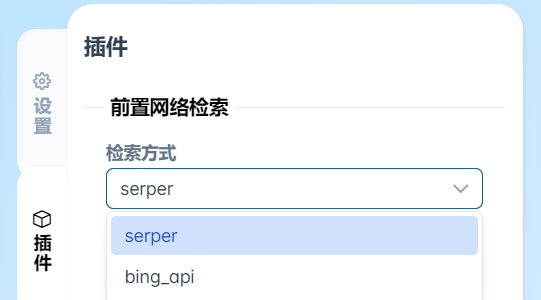

### 3.4 新增插件市场

新增插件市场，用户可以在插件市场选择不同插件，进行开启、关闭的处理，并设置、修改插件的基本参数。

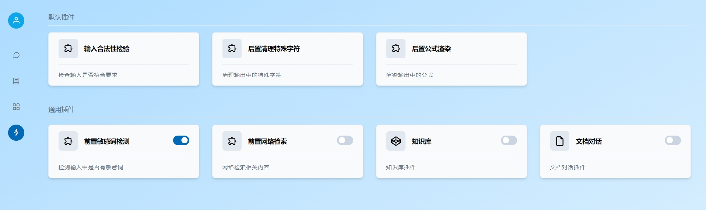

点击插件页签可以可以修改插件的基本参数。

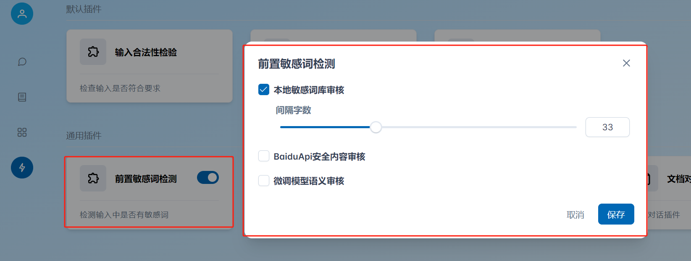

### 3.5 优化模型管理功能

增加模型下载暂停、停止功能，下载中的模型在必要时可以`暂停`、`停止`正在运行的下载任务，`暂停`功能会中断当前的下载任务，但会保留已经下载的文件及下载进度，可以通过`继续`功能重启下载任务，从暂停前的进度继续下载。停止则会删除下载任务及已经下载的模型文件。
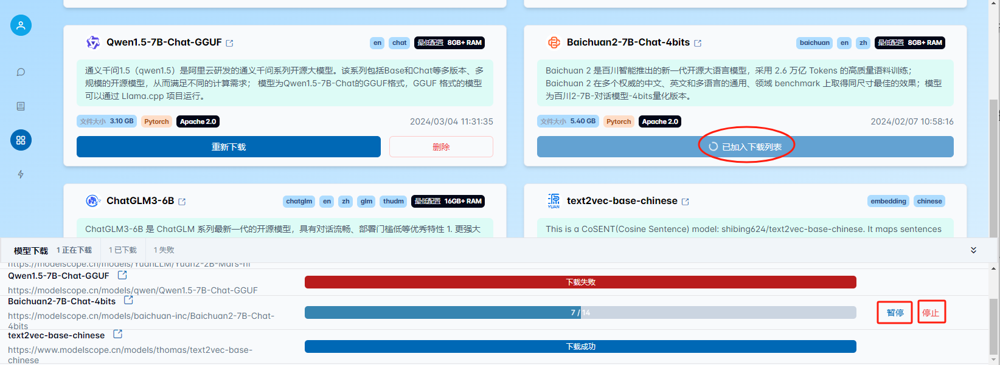

暂停的下载任务可以通过继续功能重新启动下载。
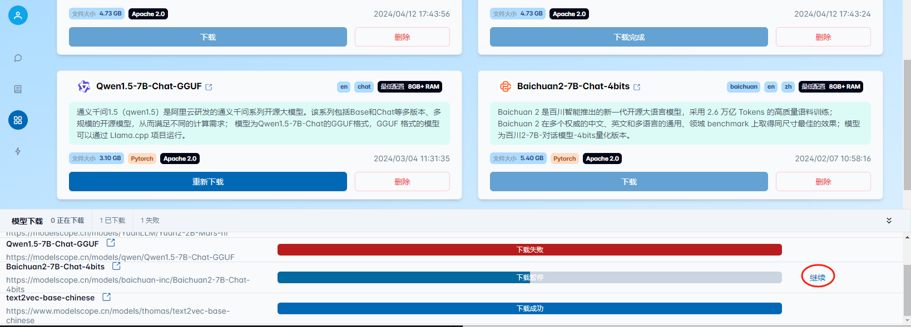

增加模型删除功能，下载完成、暂停、失败的模型可以进行删除操作，执行删除操作模型文件会删除已经下载到本地的模型文件。
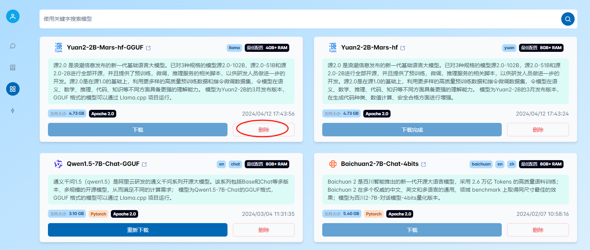

### 3.6 对话分组、重新生成、对话内容删除、模型精度切换

#### 3.6.1 对话分组
本版本，将对话，按照时间进行了分组，分为`今天`、`最近3天`、`最近7天`、`最近30天`、`更早`等组别，供用户进行方便查看，其中，可能有别个组别不存在，是用户在期间未进行过对话的原因导致，具体如下：

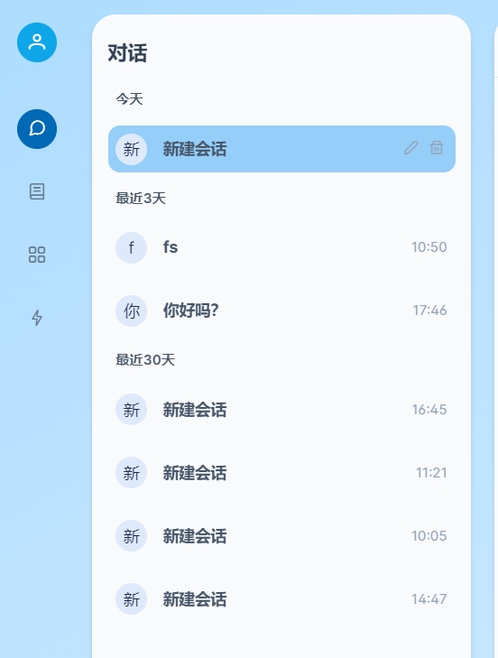

#### 3.6.1 对话重新生成功能
新增对话重新生成功能，针对当前对话结果，如果用户不满意，可以重新生成对话，系统将重新生成对话结果，具体操作位置如下：

重新生成的结果与前一次的结果同时存在，用户可以切换查看不同结果内容，具体查看方式如下：

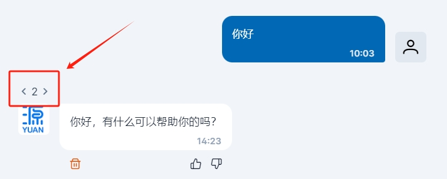

对话的历史记录中，如果存在不同结果，也会显示多个结果，可切换，供用户查看，具体如下：

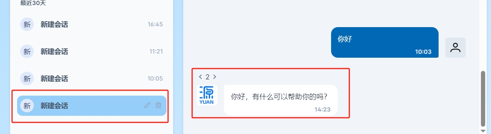

#### 3.6.2 对话内容删除
如果用户针对某次会话，觉得不满意，或者不想让其在对话历史中显示，可以将对话内容进行删除，删除后将不可见，也无法恢复。具体如下：

#### 3.6.3 模型精度切换
本次升级，针对模型，做了细粒度的管理，可以在选择模型后，再次选择不同精度的模型，进行不同模型精度的推理，具体切换方式如下：

### 3.7 新增`API Server`功能，支持使用`openai`格式返回模型推理数据

本次支持配置`API Server`功能。配置服务端口，开启服务（服务记录上次使用端口，默认为5051）。服务开启后，可查看API server支持的模型列表；支持模型输出数据转换为openAI格式。
可以通过`配置`按钮开启/关闭`API Server`功能，并设置`API Server`服务的端口号
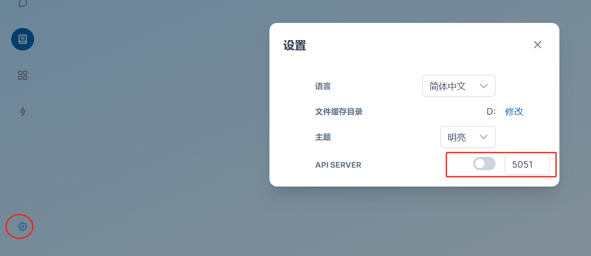

### 3.8 新增存储路径修改

本次支持用户对配置的用户缓存目录进行修改，修改时程序会检查新配置的路径空间大小是否足够存放现有模型及知识库文件，不满足则修改失败。修改成功后程序会将已经下载的模型及知识库的文件迁移至新的目录下。
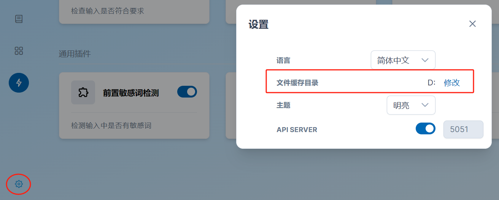