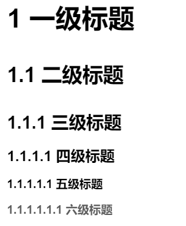

## 更新方法

### 1. 工程地址
工程地址: https://github.com/zl-jn/yuan-chat-docs.git
访问地址: https://zl-jn.github.io/yuan-chat-docs/

### 2. 工程结构
```markdown
|-- .github/workflows
    |--  build.yaml                 <!--构建文件-->
|-- docs                            <!--文档目录-->
    |-- en
        |-- index.md
        |-- AdministrationGuide
        |-- APlReference
        |-- DeveloperGuide
        |-- GettingStarted
        |-- UserGuide
    |-- override                    <!--覆盖目录, 首页html资源目录-->
    |-- pic                         <!--图片目录-->
    |-- zh
        |-- index.md
        |-- GettingStarted
        |-- AdministrationGuide
        |-- UserGuide
        |-- APlReference
        |-- DeveloperGuide
|-- mkdocs.yml                      <!--配置文件-->
|-- requirements.txt                <!--依赖文件-->
|-- version.txt                     <!--版本文件-->
```

### 2. 更新步骤


- 拉取代码
  ```shell
  git clone https://github.com/zl-jn/yuan-chat-docs.git
  ```
- 切换分支
  ```shell
  git checkout dev
  ```
- 修改 `docs` 目录下的文档
- 本地预览
  ```shell
  mike deploy dev
  mike serve
  ```
- 提交到对应分支
  ```shell
  git add . 
  git commit -m 'update docs' 
  git push dev
  ```
- 等待 `github` 构建完成
- 访问 `https://zl-jn.github.io/yuan-chat-docs/` 查看更新后的文档

### 3. 推荐工具

typora 下载地址：<https://www.typora.io/>

VS code 插件markdown all in one 、 Markdown Preview Enhanced、Markdown Preview Github Styling

### 4. 参考
<https://docs.github.com/zh/get-started/writing-on-github>

<https://markdown.com.cn/basic-syntax/headings.html>

<https://squidfunk.github.io/mkdocs-material/reference/>


# 格式说明

### 1.标题
要创建标题，请在标题文本前添加一至六个 # 符号。 你使用的 # 数量将决定层次结构级别和标题的大小。

示例:

```markdown
# 1 一级标题
## 1.1 二级标题
### 1.1.1 三级标题
#### 1.1.1.1 四级标题
##### 1.1.1.1.1 五级标题
###### 1.1.1.1.1.1 六级标题
```

效果:



---
### 2.文本样式

|样式|语法|示例|效果|
|:-:|:-:|:-:|:-:|
|加粗|** **或者__ __|\*\*加粗**| **加粗**|
|斜体|* *或者_ _|\*斜体*|*斜体*|
|删除线|\~~ \~~|\~\~删除线~~|~~删除线~~|
|粗体和嵌入的斜体|** _ _ **|\*\*粗体中嵌入 \_斜体_ 文字** | **粗体中嵌入 _斜体_ 文字**|
|全部加粗和斜体|\*\*\* \*\*\*|\*\*\*全部加粗和斜体***|***全部加粗和斜体***|
|下标|\<sub> \</sub>|文字\<sub>下标\</sub> |文字<sub>下标</sub>|
|上标|\<sup> \</sup>|文字\<sup>上标\</sup>|文字<sup>上标</sup>|
|高亮|== ==|\==高亮==|==高亮==|
|下划线|^^ ^^|\^\^下划线^^|^^下划线^^|
|键盘按键|++ ++|\+\+ctrl+alt++|++ctrl+alt++|


---
### 3.表格

使用管道符号（|）和破折号（-）来创建表格。
左对齐：在破折号的左侧加上一个冒号（:---）
右对齐：在破折号的右侧加上一个冒号（---:）
居中对齐：在破折号的两侧都加上冒号（:---:）

示例:

```markdown
| 表头1   | 表头2   | 表头3   |
| ------- | ------- | ------- |
| 单元格1 | 单元格2 | 单元格3 |
| 单元格4 | 单元格5 | 单元格6 |
| 单元格7 | 单元格8 | 单元格9 |
```

效果:

| 表头1   | 表头2   | 表头3   |
| ------- | ------- | ------- |
| 单元格1 | 单元格2 | 单元格3 |
| 单元格4 | 单元格5 | 单元格6 |
| 单元格7 | 单元格8 | 单元格9 |


---
### 4.折叠
若要使内容保持整洁，可以使用 `\<details>` 标记创建可展开的折叠部分。

示例:

```markdown
<details>
<summary>
标题1
</summary> 
这里填写折叠内容1<br>
这里填写折叠内容2
</details>
```

效果:

<details>
<summary>
标题1
</summary> 
这里填写折叠内容1<br>
这里填写折叠内容2
</details>


### 5.引用文字
要创建块引用，请在段落前添加一个 > 符号。

示例:

```markdown
> 文字示例1
> 文字示例2
```

效果:

> 文字示例1
> 文字示例2

---
### 6.引用代码

1. 使用单反引号可标注句子中的代码或命令。

    示例:

    Use \`git status\` to list all new or modified files that haven't yet been committed.

    效果：

    Use `git status` to list all new or modified files that haven't yet been committed.

2. 要将代码或文本格式化为各自的不同块，请使用三反引号。

    示例:

    \```python<br>
    print ("Hello, World")	
    \```

    效果:

    ```python
    print ("Hello, World")	
    ```

---
### 7.注释

使用类似以下的方式

```markdown
<!-- 注释内容 -->
```

---
### 8.链接

链接文本放在中括号内，链接地址放在后面的括号中，链接title可选。
超链接Markdown语法代码：\[超链接显示名](超链接地址 "超链接title")
使用尖括号可以很方便地把URL或者email地址变成可点击的链接。

示例:

```markdown
markdown的[链接](https://markdown.com.cn/)
<https://markdown.com.cn/>
```


效果:

markdown的[链接](https://markdown.com.cn/)
<https://markdown.com.cn/>

---
### 9.章节链接

使用\[链接文本](#anchor-name)创建章节链接

示例:

```markdown
参考章节[文本样式](#2 文本样式)
```

效果:

参考章节[文本样式](#2)

---
### 10.相对链接

使用\[链接文本](相对路径)创建文件相对链接

示例:

```markdown
参考文档[Alarm.md](./Alarm.md)
```

效果:

参考文档[Alarm.md](./Alarm.md)

---
### 11.图片

使用\![替代文字]\(图片URL)的语法来插入图片

示例:

```markdown
本地图片

网络图片{ align=left }
```

效果:

本地图片

网络图片

---
### 12.有序列表

要创建有序列表，请在每个列表项前添加数字并紧跟一个英文句点。数字不必按数学顺序排列，但是列表应当以数字 1 起始。

1. 第一章
2. 第二章
3. 第三章

### 13.无序列表
要创建无序列表，请在每个列表项前面添加破折号 (-)、星号 (*) 或加号 (+) 。缩进一个或多个列表项可创建嵌套列表。

示例:
```markdown
- 张三
- 张四
* 李三
* 李四
+ 王三
+ 王四
```

效果:

- 张三
- 张四
* 李三
* 李四
+ 王三
+ 王四

### 14.嵌套列表

要在保留列表连续性的同时在列表中添加另一种元素，请将该元素缩进四个空格或一个制表符

示例:

```markdown
1. 第一章
    - 第一节
        - 第一段
            - 第一行
```

效果:

1. 第一章
   - 第一节
      - 第一段
        - 第一行

---
### 15.任务列表

在列表项前加连字符和空格，后接 [ ]。 要将任务标记为完成，请使用 [x]。

示例:

```markdown
- [ ]  任务1
- [x]  任务2 已完成
- [ ]  任务3
```

效果:

- [ ]  任务1
- [x]  任务2 已完成
- [ ]  任务3


---
### 16.段落

通过在文本行之间留一个空白行，可创建新段落。

段落1

段落2

---
### 17.忽略markdown格式

通过在 Markdown 字符前面输入 \，可指示 GitHub 忽略 Markdown 格式（或对其进行转义）。

示例:

```markdown
Let's rename \*our-new-project\* to \*our-old-project\*.
```

效果:

Let's rename \*our-new-project\* to \*our-old-project\*.


---
### 18.脚注

在需要插入脚注的文本后面加上 \[^1]，其中的数字可以根据需要进行调整。
在文档的末尾或任意位置插入脚注内容，格式为 [数字]: 脚注内容。

示例:

```markdown
Here is a simple footnote[^1].
A footnote can also have multiple lines[^2].

[^1]: My reference.
[^2]: To add line breaks within a footnote, prefix new lines with 2 spaces.  This is a second ine.
```

Here is a simple footnote[^1].
A footnote can also have multiple lines[^2].

[^1]: My reference.
[^2]: To add line breaks within a footnote, prefix new lines with 2 spaces.  This is a second ine.

效果:


### 19. 警告
一个块以开头，后跟一个用作类型限定符的关键字。块的内容紧随其后，缩进四个空格：!!!
示例
```markdown
??? info
    这是一个info
```
效果
??? info
    这是一个info

其他效果
??? note "这里写标题"
    这是一个note

??? abstract
    这是一个abstract

??? tip
    这是一个tip

??? success
    这是一个success

??? question
    这是一个question

??? warning
    这是一个warning

??? failure
    这是一个failure

??? danger
    这是一个danger

??? bug
    这是一个bug

??? example
    这是一个example

??? quote
    这是一个quote

### 20. 附注

```markdown
附注的示例(1),图标可以点开查看附注内容。
{ .annotate }

1. 这是附注的内容
```

附注的示例(1),图标可以点开查看附注内容。
{ .annotate }

1. 这是附注的内容


### 21. 按钮

示例
```markdown
[跳转](#){ .md-button }
```

效果
[跳转](#){ .md-button }


### 22. 代码块
#### 代码复制
复制
``````markdown
``` { .yaml .copy }
# Code 
```
``````

禁止复制
``````markdown
``` { .yaml .no-copy }
# Code block content
```
``````

复制
``` { .yaml .copy }
# Code block content
```

禁止复制
``` { .yaml .no-copy }
# Code block content
```

#### 代码标题

``````markdown
```c title="hw.c" linenums="1"  hl_lines="4"
#include <stdio.h>
 
int main(){
    printf("Hello, World");
    return(0);
}
```
``````

```c title="hw.c" linenums="1"  hl_lines="4"
#include <stdio.h>
 
int main(){
    printf("Hello, World");
    return(0);
}
```

### 23. 内容选项卡

``````markdown
=== "c"

    ```c
    #include <stdio.h>

    int main(){
        printf("Hello, World");
        return(0);
    }
    ```

=== "C++"

    ```c++
    #include <iostream>

    int main(void) {
      std::cout << "Hello world!" << std::endl;
      return 0;
    }
    ```

``````

=== "c"

    ```c
    #include <stdio.h>

    int main(){
        printf("Hello, World");
        return(0);
    }
    ```

=== "C++"

    ```c++
    #include <iostream>

    int main(void) {
      std::cout << "Hello world!" << std::endl;
      return 0;
    }
    ```

### 24. 网格
列表语法本质上是卡片网格的快捷方式，由一个无序（或有序）列表组成，该列表由 a 和 类包装：divgridcards

```markdown
<div class="grid cards" markdown>

- 1 第一章
- 2 第二章
- 3 第三章
- 4 第四章

</div>
```

<div class="grid cards" markdown>

- 1 第一章. abcdefghijklmnopqrstuvwxyx
- 2 第二章. abcdefghijklmnopqrstuvwxyx
- 3 第三章. abcdefghijklmnopqrstuvwxyx
- 4 第四章. abcdefghijklmnopqrstuvwxyx
- 4 第四章. abcdefghijklmnopqrstuvwxyx

</div>

### 25. 表情/图标
表情符号可以通过将表情符号的简码放在两个冒号之间来集成到 Markdown 中。
```markdown
:smile:
:+1:
:tada:
:100:
```

:smile:
:+1:
:tada:
:100:
:duck:
:horse:

支持的表情/图标

:material-material-design: – [Material Design](https://pictogrammers.com/library/mdi/)

:fontawesome-brands-font-awesome: – [FontAwesome](https://fontawesome.com/search?m=free)

:octicons-mark-github-16: – [Octicons](https://primer.style/foundations/icons)

:simple-simpleicons: – [Simple Icons](https://simpleicons.org/)

:grinning: – [Emojis](https://emojipedia.org/)

### 26. 数学公式
数学公式内联块必须包含$...$中
数学公式块必须包含在单独的行中或单独的行中：$$...$$


```markdown
当我们探索自然界的奥秘时，数学成为了一种无可替代的语言。从简单的

$$
1 + 1 = 2
$$

到复杂的 $e^{i\pi} + 1 = 0$，数学在解释和预测现象方面发挥着重要作用。
让我们思考一个简单的几何问题，如直角三角形。在一个直角三角形中，勾股定理 

$$
a^2 + b^2 = c^2
$$

 揭示了直角边与斜边之间的关系。这个简单的公式贯穿了几何学和代数学，成为诸多数学分支的基石。
在微积分领域，牛顿-莱布尼茨公式 

$$
\int_a^b f(x) \,dx = F(b) - F(a)
$$

展示了积分与导数的关系。这个公式揭示了函数与其累积变化之间的联系，对于计算面积、体积以及许多实际问题的建模都具有重要意义。
数学与自然界的联系不仅仅体现在公式中，还可以在自然界的模式中找到。例如，旋涡状的海贝壳外形类似于斐波那契数列，其每个数字是前两个数字之和： 

$$
1, 1, 2, 3, 5, 8, 13, \dots
$$

这种数学模式在数学、生物学和艺术中都有出现，展示了数学的美妙多样性。

$$
\lim_{n \to \infty} \frac{1}{n(n+1)} \quad and \quad \lim_{x\leftarrow{示例}} \frac{1}{n(n+1)}
$$
```
当我们探索自然界的奥秘时，数学成为了一种无可替代的语言。从简单的

$$
1 + 1 = 2
$$

到复杂的 $e^{i\pi} + 1 = 0$，数学在解释和预测现象方面发挥着重要作用。
让我们思考一个简单的几何问题，如直角三角形。在一个直角三角形中，勾股定理 

$$
a^2 + b^2 = c^2
$$

 揭示了直角边与斜边之间的关系。这个简单的公式贯穿了几何学和代数学，成为诸多数学分支的基石。
在微积分领域，牛顿-莱布尼茨公式 

$$
\int_a^b f(x) \,dx = F(b) - F(a)
$$

展示了积分与导数的关系。这个公式揭示了函数与其累积变化之间的联系，对于计算面积、体积以及许多实际问题的建模都具有重要意义。
数学与自然界的联系不仅仅体现在公式中，还可以在自然界的模式中找到。例如，旋涡状的海贝壳外形类似于斐波那契数列，其每个数字是前两个数字之和： 

$$
1, 1, 2, 3, 5, 8, 13, \dots
$$

这种数学模式在数学、生物学和艺术中都有出现，展示了数学的美妙多样性。

$$
\lim_{n \to \infty} \frac{1}{n(n+1)} \quad and \quad \lim_{x\leftarrow{示例}} \frac{1}{n(n+1)}
$$

