# 在笔记本上快速部署Yuan-2B模型和YuanChat

## 1. 配置要求 //todo 具体配置需要验证
* 内存: 16GB+
* 系统: windows10/11 或 macos
* GPU: Nvidia GPU，在 GTX3070 上通过验证

## 2. 环境准备

### 2.1. 安装Docker Desktop 
首先，请在系统中安装[DockerDesktop](https://www.docker.com/products/docker-desktop/)，完成安装后，启动`Docker Desktop`，启动成功后，会看到如下页面
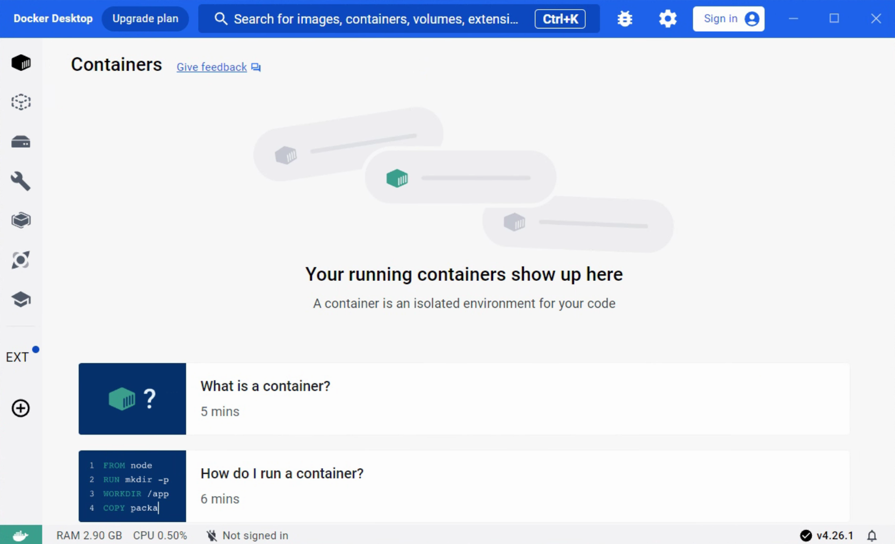

### 2.2. 下载模型
1. 打开[Yuan-2B模型](https://huggingface.co/IEITYuan/Yuan2-2B-hf)页面， 进入到模型文件列表
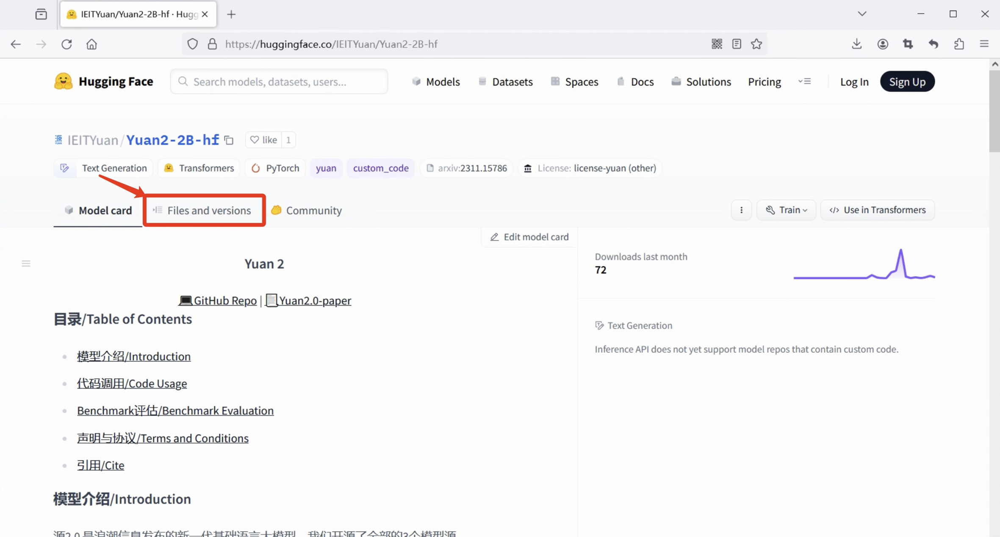
依次下载模型文件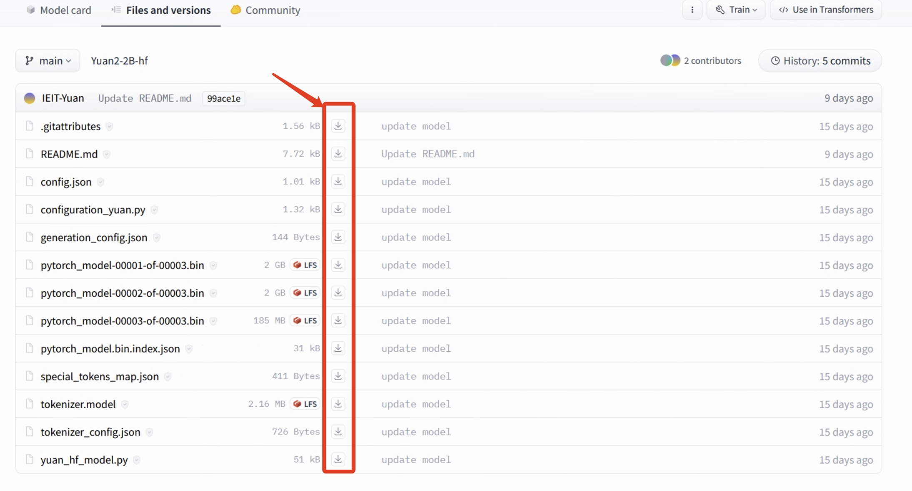
2. 新建一个文件（本示例中取名为`Yuan2-2B-hf`），将下载好的文件放到此文件夹中。
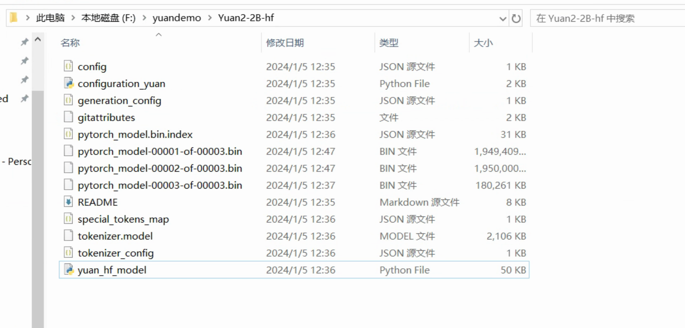

> **注意: 如果你的环境中不存在`GPU`或你想在`CPU`模式下运行，需要修改模型文件`config.json`和`yuan_hf_model.py`**
> ```python
> 1. config.json
> 将 user_flash_attention 的值改为 false
>
> 2. yuan_hf_model.py 
> 1)注释掉 yuan_hf_model.py中第35、36行；
> 2)修改yuan_hf_model.py中第271行代码为:
> inference_hidden_states_memory = torch.empty> (bsz, 2, hidden_states.shape[2], > dtype=hidden_states.dtype)
> ```
### 2.3. 拉取镜像
我们封装了一个可直接运行`Yuan Model`推理和`YuanChat`的镜像，可已通过如下命令进行拉取，如果你的环境中有`GPU`，请使用第二条命令，这样可以加速你的推理过程，更快地获取结果。
```shell
#for only CPU
docker pull yuanmodel/yuanchat:all-cpu
```
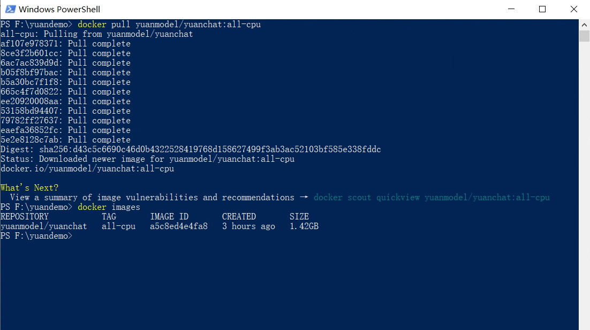

### :tada: ***到此，我们的所有准备工作已经完成，可以开始运行测试了。***

## 3.运行测试

### 3.1 启动服务
```shell
# powder shell
# 进入到模型文件所在目录
cd f:\yuandemo
# 启动模型+Chat服务
docker run -d --name all-in-one -p 5050:5050 -v f:\yuandemo\Yuan2-2B-hf:/models yuanmodel/yuanchat:all-cpu
```
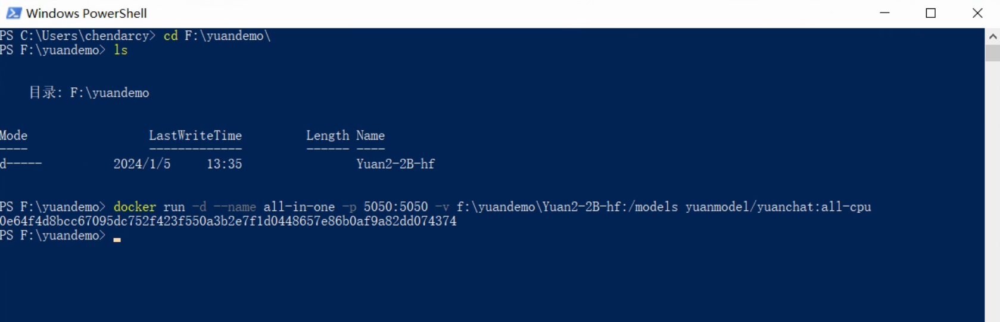

### 3.2 检查服务
打开`Docker Desktop`的`Containers`菜单，可以看到一个名为`all-in-one`的容器，查看此容器的详情
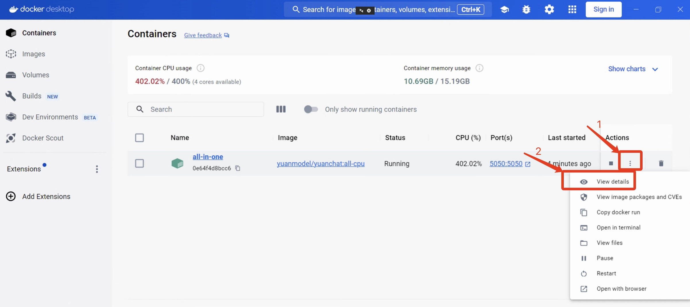
当详情页出现如下输出时，表示服务启动完毕
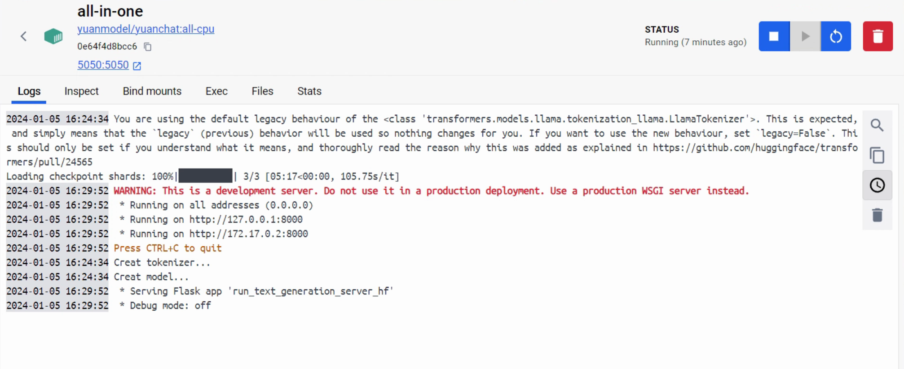

### 3.3 测试服务
用浏览器打开地址: [http://localhost:5050](http://localhost:5050)，会看到如下页面
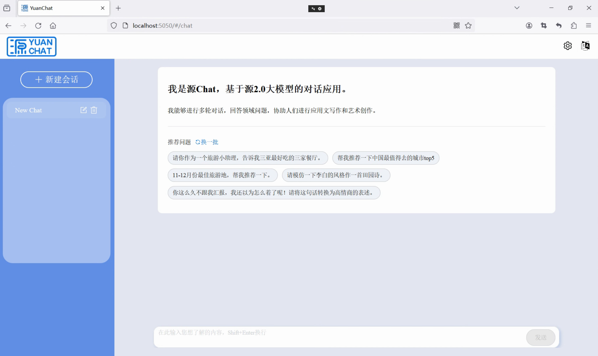
# :taba:到此，恭喜你已完成部署，现在可以体验和测试Yuan大模型了！

## FAQ
### 1. Docker 虚拟内存不够，导致服务启动失败
如果你是初次安装的`Docker Desktop`，或没有配置过`.wslconfig`文件，在启动服务时，会出现如下错误
```bash
2024-01-05 17:14:04 You are using the default legacy behaviour of the <class 'transformers.models.llama.tokenization_llama.LlamaTokenizer'>. This is expected, and simply means that the `legacy` (previous) behavior will be used so nothing changes for you. If you want to use the new behaviour, set `legacy=False`. This should only be set if you understand what it means, and thoroughly read the reason why this was added as explained in https://github.com/huggingface/transformers/pull/24565
2024-01-05 17:14:04 Creat tokenizer...
2024-01-05 17:14:04 Creat model...
Loading checkpoint shards:   0%|          | 0/3 [00:00<?, ?it/s]start.sh: line 4:     8 Killed                  python -u run_text_generation_server_hf.py
```
#### 解决方案：
**Windows系统**
1. `win+R`，并输入`%UserProfile%`，点击回车

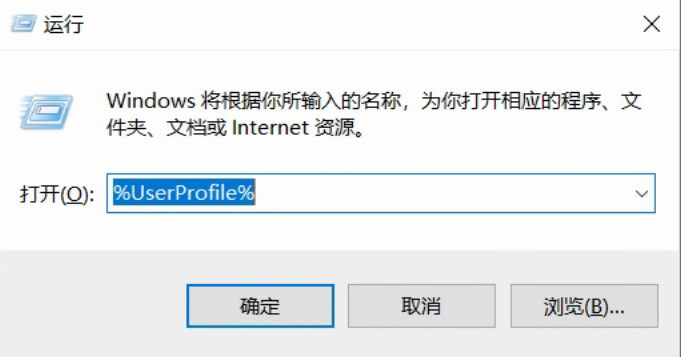

2. 在打开的目录中新建`.wslconfig`文件，用记事本打开，并输入如下内容
```shell
[wsl2]
memory=16GB
processors=4
swap=0
```
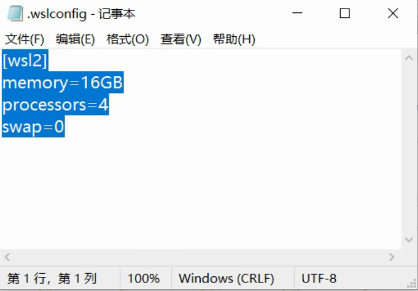

3. 重启`wsl`
打开`Powershell`，并执行如下命令
```shell
wsl --shutdown
```

4. 重新启动`Docker Desktop`

5. 重启服务