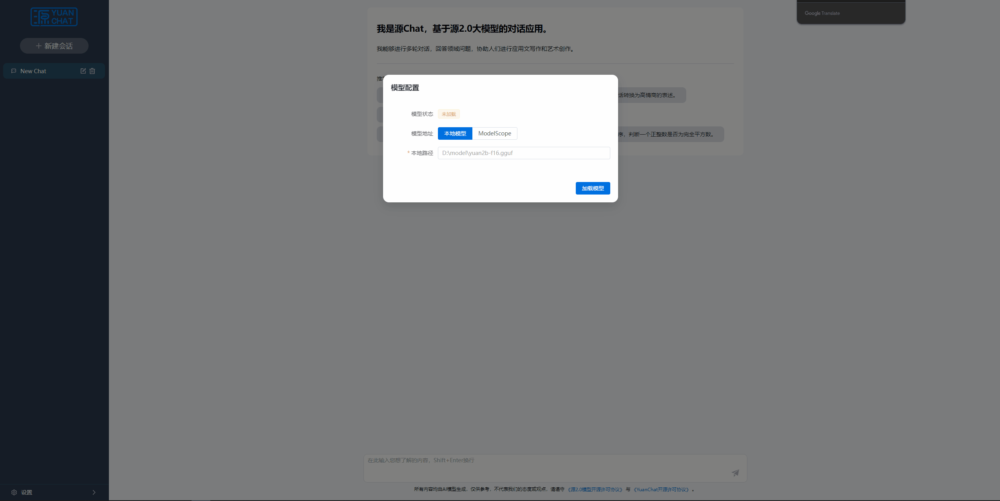
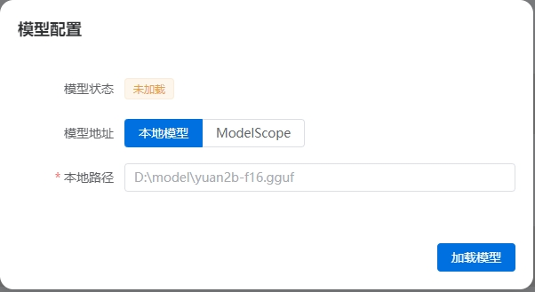
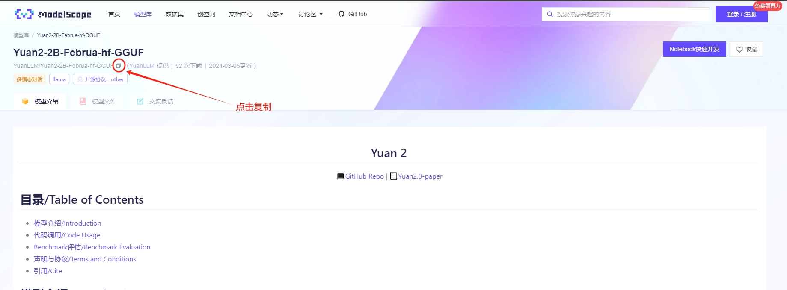
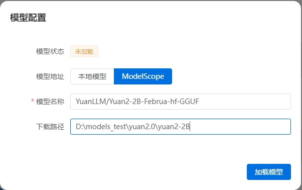
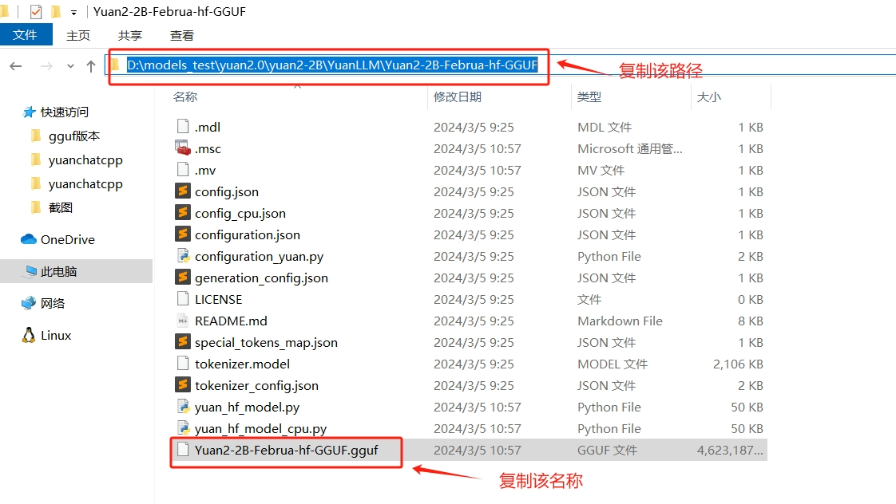
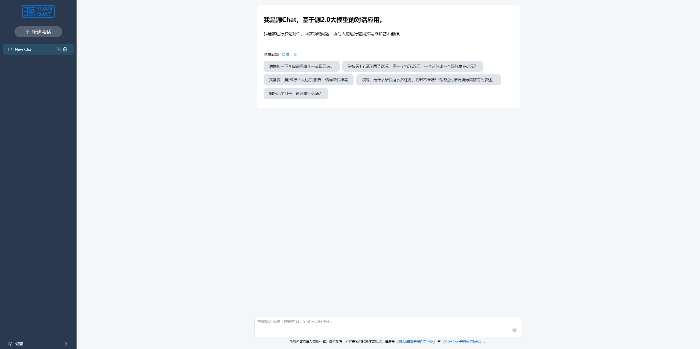

# 基于llamacpp的 Yuanchat.exe 使用教程

## 1. 配置要求 
* 可使用内存：400MB以上
* 系统: windows10/11 64位

## 2. 软件下载
### 2.1 百度云盘
**链接**：https://pan.baidu.com/s/1fVWKNL-GQum4PCsU8YNruQ?pwd=qq4g

> 本版本只适用于`gguf`格式模型。

### 2.2 版本对比

<table>
<tr>
<th rowspan="2">推理性能</th><th>GGUF格式（C++）</th><th>HF格式（Python）</th><th>加速比</th>
</tr>
<tr>
<td align="center">9.34 tokens/s</td><td align="center">1.21 tokens/s</td><td align="center">7.72</td>
</tr>
<tr>
<th rowspan="2">内存占用</th><th>GGUF格式（C++）</th><th>HF格式（Python）</th><th>内存占比（GGUF/HF）</th>
</tr>
<tr>
<td align="center">~0.4 GB</td><td align="center">~8.6 GB</td><td align="center">4.65%</td>
</tr>
</table>

## 3. 运行YuanChat.exe

> `YuanChat.exe`占用本地的`5050`端口，如果系统中有其他应用占用了此端口会导致`YuanChat.exe`启动失败，请使用前确认系统环境。

`YuanChat.exe`支持两种方式对模型进行加载: **本地模型** 和 **在线加载（ModelScope）**

### 3.1 在线加载（ModelScope，需要联网）
如果是第一次运行`YuanChat.exe`，且没有下载过`Yuan2-2B`的`gguf`模型，可以选择`ModelScope`方式进行模型的下载。
`Yuan2-2B`的`gguf`模型在`ModelScope`的路径为：[模型地址链接](https://www.modelscope.cn/models/YuanLLM/Yuan2-2B-Februa-hf-GGUF/summary)。

打开链接后，点击复制按钮复制模型地址。

复制模型地址到输入框，并填写一个本地目录用于保存模型(下一次启动不用再次下载)

待模型下载完成后，会自动加载，加载完成后即可开始使用

### 3.2 本地模型
此种方式适用于本地已有下载的模型，复制模型所在目录地址，及模型文件的文件名称，即复制模型文件全路径信息，填写到页面中

本地模型加载完成后，即可开始使用

## 4. 问题反馈
如果在使用程序过程中有任何问题，欢迎在本项目的`issue`中进行提问