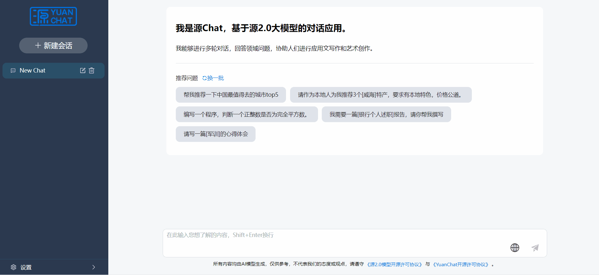
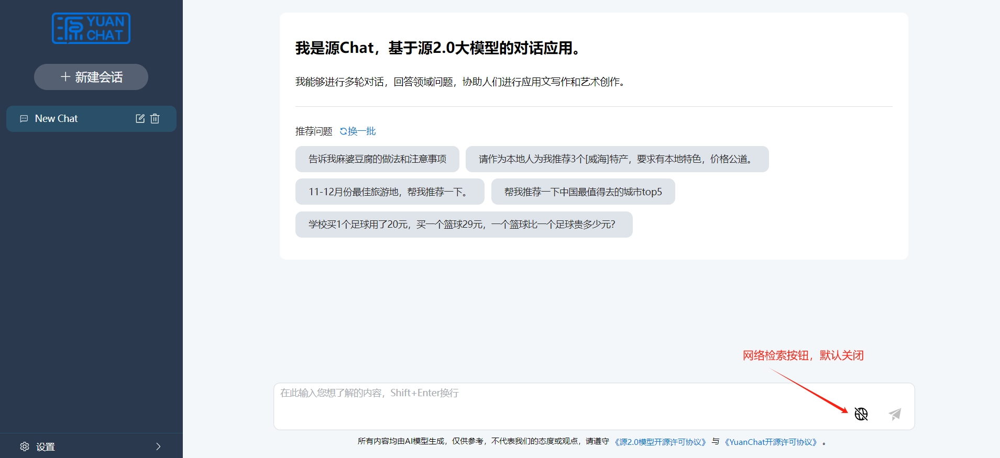
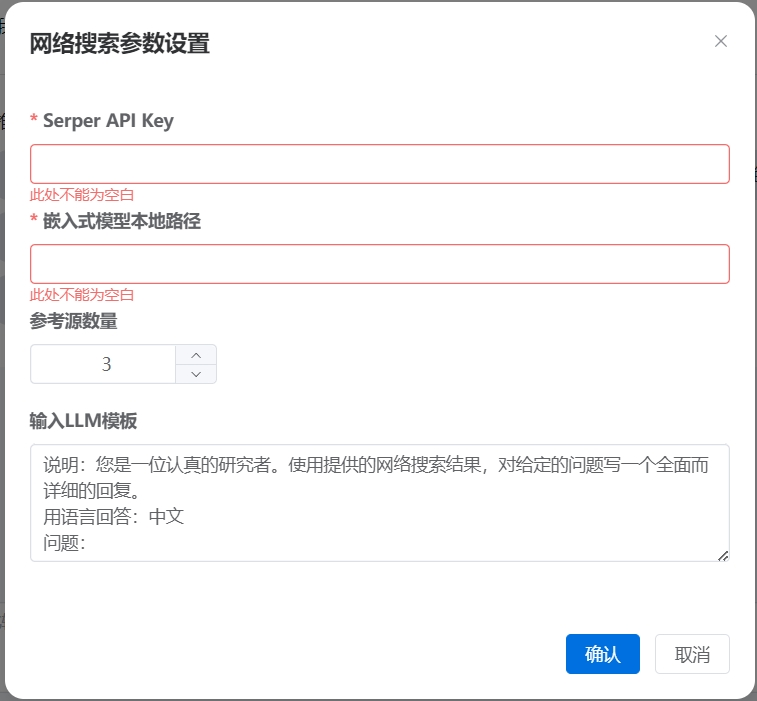

# 支持网络搜索的新功能

## 配置要求 
* 内存: 16GB及以上
* 系统: windows10/11 64位

## 环境准备

1. 正常准备源2.0的相关环境，参见 [Readme](../README.md)

2. 网络搜索使用的是搜索引擎服务Serper，因此首先需要准备搜索引擎服务Serper的API Key，通过 https://serpapi.com/ 注册获取。

3. 嵌入式模型下载，您需要准备一个embedding模型，以进行文本向量化，建议使用HuggingFace上的[text2vec-base-chinese](https://huggingface.co/shibing624/text2vec-base-chinese)

准备好后，即可正常使用网络搜索功能。

## 使用网络搜索

首先，展示下效果图

搜索按钮在对话输入框的右侧，默认关闭状态，如需启用，点击即可。具体见下图：

点击网络搜索按钮后，弹出参数配置页面，具体如下：

其中`Serper API Key` 为您在搜索引擎服务Serper中申请的API Key，此为必填项，如果不填则无法使用网络搜索功能。`嵌入式模型本地路径` 为您在本地下载安装好的embedding模型路径，此为必填项，如若不填，无法进行推理。
`参考源数量`为您希望通过网络获取到的网页个数，取值范围为[1,8]，`输入LLM模板`为您给推理模型提供的前置文本，此为默认值，您可按照您的意愿进行修改。

完成上述步骤后，您就可以正常使用网络搜索功能了。如果想关闭网络搜索功能，则再次点击网络搜索按钮即可关闭。

最后，系统将给我最终结果，其中包含推理结果、参考源、推荐问题等，其中参考源为参考的网络源信息，包含了标题、内容，点击标题可以进入原始网页；
推荐问题为根据您所提问的问题，推荐的其他相关问题，您可以直接点击该问题，就可以将其放入输入框，继续提问。

> _如果您想了解更多网络搜索功能的服务端信息，具体参见 [README-WEB](../src/python/README-web.md)_