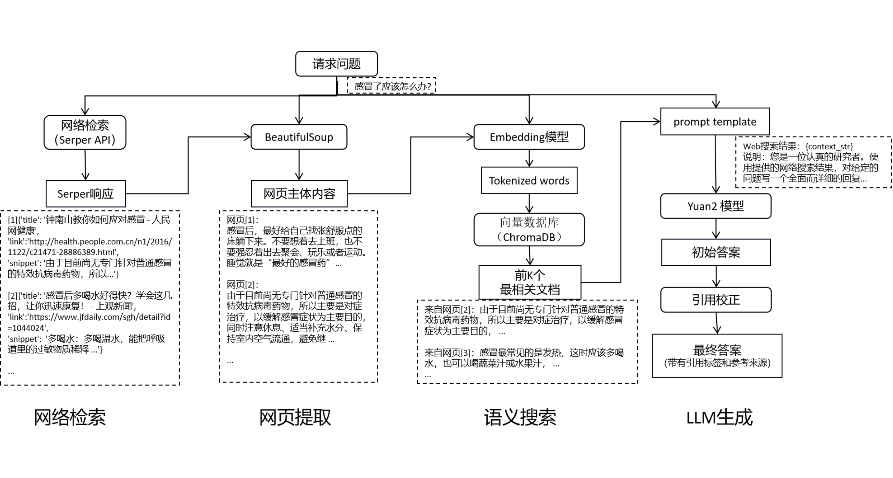

<div align="center">

# web检索增强的源Chat 服务端介绍

</div>

## 基本原理


整体流程如下：

    1. 通过 Serper (Google API) 进行快速实时的网络搜索，能够根据输入自动调整网络搜索地区和响应语言
    2. 从多个网页中多线程提取主体内容，以降低embedding中token数量的花费
    3. 通过 OpenAI Embedding 和 ChromaDB 实现相关语义的搜索
    4. 大模型根据参考的网络信息生成回答
    5. 将大语言模型回答中带引用的句子与源网站的标题、相关文档和链接进行匹配


## Yuan2.0 模型推理 API 部署
[Yuan-2.0](https://github.com/IEIT-Yuan/Yuan-2.0/tree/main), 部署 docker [参考](https://github.com/IEIT-Yuan/Yuan-2.0/blob/main/README.md#快速启动), 获取推理服务的request url：http://127.0.0.1:8000，[参考](https://github.com/IEIT-Yuan/Yuan-2.0/blob/main/docs/inference_server_cn.md)

**注意：** 为了更好的体验效果，建议选择51B或102B模型部署


## 接口服务部署
在本项目的根目录中有`docker_build.sh`和`docker_run.sh`，分别用于制作服务端镜像和启动服务端容器，你可以直接运行这两个命令，来制作和启动。
需要注意的是，如果你的Yuan2.0模型服务部署在其他机器上，你需要在启动容器时，加上`-e YUAN_2_URL=http://ip:port/yuan`，来指定你的模型服务地址。

## 接口服务介绍
目前后端服务只提供一个接口供UI侧调用，后端使用编程语言为Python，提供接口为Restful方式。 接口以SSE（Server Send Event）的方式与ui侧交互。

接口交互信息如下：

**接口地址**：

`http://ip:port/sse/subscribe`

其中，ip为服务部署的机器ip，port目前在docker中以5050对外暴露。
即：`http://ip:5050/sse/subscribe`

**请求方式**：`POST`

**请求数据类型**：`application/json`

**响应数据类型**：`text/event-stream`

**接口描述**：用户发送推理请求，并接收推理结果

**请求参数**：

| 参数名称          | 参数说明                                                                             | 类型                | 备注 | 取值范围                                                          |
|-----------------|----------------------------------------------------------------------------------|-------------------|----- |---------------------------------------------------------------|
| messages        | 用户请求信息                                                                           | list[dict_object] | 是 | 具体字典内容见下方补充描述                                                 |
| response_length | 模型推理返回结果的最大 token 序列长度。该参数设置越大，模型生成答案耗时越长。设置过短可能影响生成结果的完整性。token 可能是一个字、词或者标点    | int               | 否 | 默认值为5000，范围[0,8000]                                           |
| temperature     | temperature 值越大，模型的创造性越强，但生成效果不稳定。temperature 值越小，模型的稳定性越强，生成效果稳定。               | float             | 否 | 默认值0.6，范围：[0,1]                                               |
| top_p           | 生成 token 的概率累加，从最大概率的 token 往下开始取，当取到累加值大于等于 topP 时停止。当 topP 为 0 时，该参数不起作用。      | float             | 否 | 默认值0.95， 范围[0,1], 与top_k不可同时生效                                |
| top_k           | 挑选概率最高的 k 个 token 作为候选集。若 k 值为 1，则答案唯一。当 topK 为 0 时，该参数不起作用。该参数与top_p不能同时起作用。    | int               |否 | 默认值0，范围：[0,10], 与top_p不可同时生效                                  |
| retrieve_topk   | 从获取的多个网页内容中挑选与输入最相关的 k 个文档。                                                      | int               |否 | 默认值3，范围：[1,8]                                                 |
| template   | 将检索到的参考文档与问题按prompt格式组合，输入LLM的模板                                                 | str               |否 | "说明：您是一位认真的研究者。使用提供的网络搜索结果，对给定的问题写一个全面而详细的回复。\n用语言回答：中文\n问题：" |
| embeddings_model_path   | Embedding模型本地路径，建议选择对中文区分度比较好的embedding模型：HuggingFace上的[text2vec-base-chinese](https://huggingface.co/shibing624/text2vec-base-chinese) | str               |否 | 无                                                             |
| access_key | 搜索引擎服务Serper的API Key，通过 https://serpapi.com/ 注册获取                                | str               |否 | 无                                                           |
| browser_flag | 网络检索标识                                                                           | bool |否 | 默认false |


对dict_object的补充描述，messages为字典列表，用于传递多轮对话信息，对话不宜超过10轮。

| 参数名称 | 参数说明 | 类型 | 备注 |
| -------- | -------- | ----- |----- | 
|question| 用户问题 | string | 是 | 值为用户历史问题|
|answer| 系统推理结果 | string | 否 | 值为系统历史推理结果，与question一一对应，最后一条置为空字符串即可|

**请求示例**：
```
{
    "messages":[
        {
            "question": "泰山在哪里？",
            "answer": ""
        }],
    "top_p":0.95,
    "top_k":0,
    "response_length":500,
    "temperature":0.6,
    "retrieve_topk":3,
    "template": "说明：您是一位认真的研究者。使用提供的网络搜索结果，对给定的问题写一个全面而详细的回复。\n用语言回答：中文\n问题：",
    "embeddings_model_path": "xxxx",
    "access_key": "yyyy",
    "browser_flag":true
}
```

**响应参数**：

| 参数名称 | 参数说明 | 类型 | 备注 |
| -------- | -------- | ----- |----- | 
|errCode| 错误码 |string| 错误标识码|
|errMessage|错误信息 |string|错误说明信息|
|exceptionMsg|异常信息|string| 异常说明信息|
|flag| 结果状态 |boolean| true标识系统正常，false标识系统出错|
|resData| 推理结果| dict_object | 具体信息见下方补充说明 |

对resData的结构dict_object补充说明：

| 参数名称 | 参数说明 | 类型 | 备注 |
| -------- | -------- | ----- |----- |
| message | 推理结果 | string |  |
| time | 推理完成时间 | int | 13位时间戳格式 |
| refs | 网页内容 | list[dict_object] | 具体字典内容参见下方说明 |
| peopleAlsoAsk | 推荐问题 | list[dict_object] | 具体字典内容参见下方说明 |

对`refs`中字典内容描述，具体如下:

| 参数名称 | 参数说明             | 类型   | 备注 |
| -------- | -------------------- | ------ | ---- |
| url      | 参考的网络地址       | string |      |
| text     | 当前地址中参考的内容 | string |      |
| title    | 当前地址的内容标题   | string |      |

对peopleAlsoAsk字典的描述，具体内容如下：

| 参数名称 | 参数说明     | 类型   | 备注question |
| -------- | ------------ | ------ | ------------ |
| question | 具体问题内容 | string |              |

以上即为接口服务描述，如需二次开发，可以到代码`/src/python/yuan_processing/yuanchat.py`中进行查看修改。
